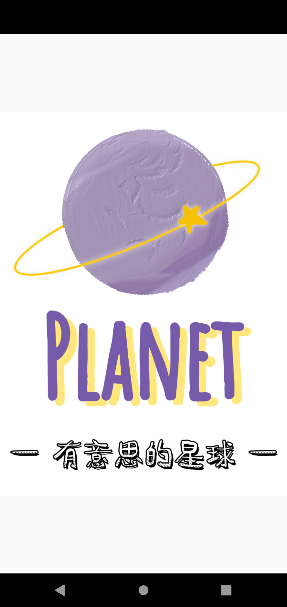
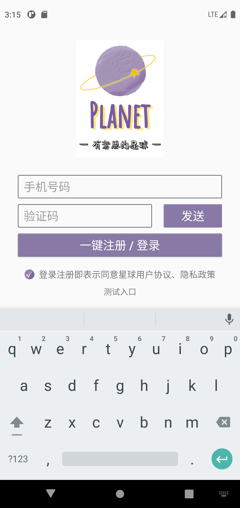

# 星球App简介

一款基于Android原生开发的社交类App，在此感谢融云、比目云等第三方云服务平台~

## 项目信息

语言：Java

IDE：Android Studio

minSdk ：21

targetSdk： 31

JDK：1.8

### 第三方框架：

Bmob ：http://doc.bmob.cn/

RongCloud：https://www.rongcloud.cn/devcenter?type=doc

</img>
</img>
