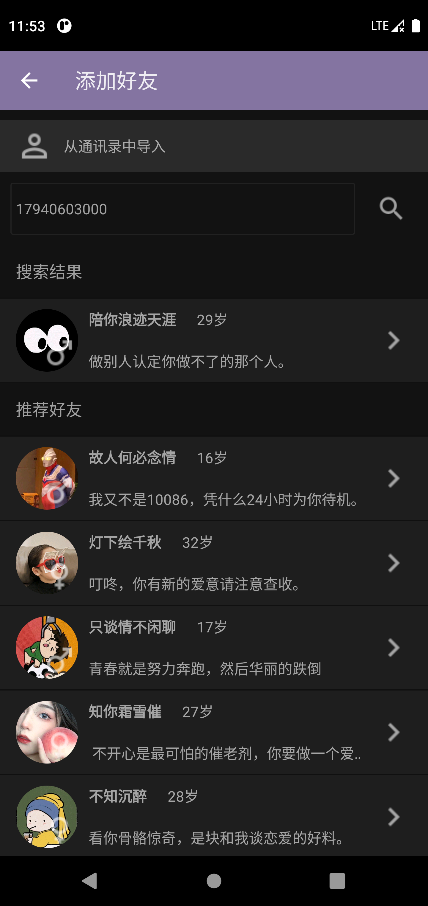
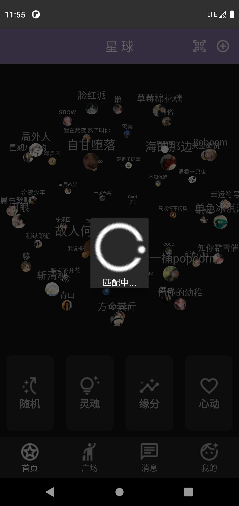

# 星球App简介

一款基于Android原生开发的社交类App，在此感谢融云、比目云等第三方云服务平台~

# 项目信息

语言：Java

IDE：Android Studio

minSdk ：21

targetSdk： 31

JDK：1.8

# 技术栈

- 自定义 3D 球形标签云 View 实现用户标签 360°全方向滚动效果；
- 基于 Bmob SDK 实现短信验证功能以及用户管理模块；
- 集成开源框架 Glide 实现图片加载，使用 OkHttp 框架实现网络通信，使用 Zxing 实现二维码扫描；
- 通过融云 SDK 后台接口获取 Token 后连接第三方服务体系，整合 LitePal 数据库和 EventBus 事件栈，
- 搭建通讯层搭框架，并且增加支持讯飞的语音听写模块，实现即时通讯和音视频通话功能；
- 针对启动、内存等方面进行性能优化；多渠道打包、加固和混淆使得星球 App 更加安全。

# 架构设计

## 总体架构


### 星球首页（HomeFragment）


### 广场（SquareFragment）


### 聊天（ChatFragment）


### 我的信息（MeFragment）


# 功能展示

（按照用户点击应用图标进入本App的时序展示）

## 启动页

逻辑：

1. 使用醒图或者美图秀秀在背景布添加内置贴纸和艺术字。
2. 用Handler发送2000ms'延时空消息显示启动页。
3. 根据本地保存的是否登陆过的token决定是跳转到登录页还是主页。
4. 启动优化：
    - 视图优化（治标不治本）
        - 设置主题透明（冷启动时创建的空白window设置为透明）；
        - 设置启动图（冷启动时创建的空白window设置background与启动页一致）；
    - 代码优化
        - 优化Application(必要组件放在主页初始化或者开启子线程)；
        - 布局优化，减少嵌套；
        - 避免阻塞UI线程、过多占用主线程的操作
        - 避免加载Bitmap/大图，可以压缩图片；


</img>

## 登录页

逻辑：

1. 检查“手机号码”不为空且勾选用户协议才可以点击“发送”。点击“发送”后使用Handler发送延时消息，开始60s倒计时，一分钟内只能发送一次验证码。

2. 检查“手机号码”和“验证码都不为空”且勾选用户协议才可以“一键注册/登录”。

3. 点击“一键注册/登录”按钮时，立即显示自定义的旋转动画LoadingView，并重写Bmob监听器注册用户的回调方法done()，在done()方法中隐藏LoadingView，这样当登录完成后加载对话框就消失了。

4. 登陆成功后本地保存相应的token并跳转到主页（第二次进入App不需要登录直接进入主页）。

   登陆失败就根据错误码显示相关提示信息。

    - 有关用户信息，需要自定义PlanetUser类，定义昵称、性别、头像、个性签名、标签、状态等属性，并在类中实现get属性和set属性的方法。有关用户各种信息的变动，实际上是维护这张表的增删改查。


</img>


## 申请权限

逻辑：

1. 在BaseActivity中动态申请所有权限。
2. 用户进入主页开始连续选择是否授予一系列的权限，允许的权限放在一个list中，拒绝的权限放在一个list中。
3. 等到用户实际访问某个需要权限的功能时（如添加好友访问通讯录），check该权限是否在允许列表中，若在直接使用，若不在，再次动态申请。

</img>


## 星球首页

### 星球展示

</img>

### 搜索添加

</img>

### 匹配用户

</img>    </img

## 广场

### 发表动态

</img>

### 刷新动态

</img>

## 消息

### 双设备互加好友并即时通信

</img>

</img>

</img>

</img>

</img>

</img>

</img>

</img>

## 我的

</img>

### 更改信息

</img>

### 新朋友

</img>

### 隐私设置

</img>

### 分享二维码

</img>

### 通知

</img>

### 设置

</img>

# 感谢第三方框架

```
//Bmob
implementation 'io.github.bmob:android-sdk:3.8.13'
implementation 'io.reactivex.rxjava2:rxjava:2.2.8'
implementation 'io.reactivex.rxjava2:rxandroid:2.1.1'
implementation 'com.squareup.okhttp3:okhttp:4.8.1'
implementation 'com.squareup.okio:okio:2.2.2'
implementation 'com.google.code.gson:gson:2.8.5'

// 融云即时通讯SDK
implementation 'cn.rongcloud.sdk:im_lib:5.2.2'
// 融云音视频通话SDK
implementation 'cn.rongcloud.sdk:call_lib:5.2.2'

//第三方图片加载框架Glide
implementation 'com.github.bumptech.glide:glide:4.11.0'

//圆形头像
implementation 'de.hdodenhof:circleimageview:3.1.0'

//OkHttp
// define a BOM and its version
implementation(platform("com.squareup.okhttp3:okhttp-bom:4.9.3"))

// define any required OkHttp artifacts without version
implementation("com.squareup.okhttp3:okhttp")
implementation("com.squareup.okhttp3:logging-interceptor")

// video player
implementation 'cn.jzvd:jiaozivideoplayer:7.0.5'

// 日历选择
implementation 'cn.aigestudio.datepicker:DatePicker:2.2.0'

// LitePal Database
implementation 'org.litepal.guolindev:core:3.2.3'

// 二维码
implementation 'cn.yipianfengye.android:zxing-library:2.2'

// eventbus
implementation 'org.greenrobot:eventbus:3.3.1'

// search
implementation 'com.amap.api:search:5.0.0'
```